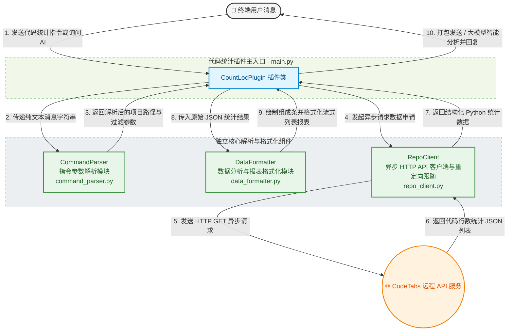

<!-- markdownlint-disable MD028 -->
<!-- markdownlint-disable MD033 -->
<!-- markdownlint-disable MD041 -->


<p align="center">
  
  
  
</p>

<p align="center">
  
  
  
</p>

<p align="center">
  
  
  
</p>

[](https://github.com/DBJD-CR/astrbot_plugin_count_loc)


---

一个为 [AstrBot](https://github.com/AstrBotDevs/AstrBot) 设计的公开代码仓库行数统计分析插件。
只需在聊天对话中发送指令，即可对任意公开的 GitHub 或 GitLab 仓库的代码行数、文件数量、注释行数、物理总行数等指标进行快捷获取和分析。
并且支持自定义指定分支以及忽略特定目录与文件，还可以用自然语言让 LLM 自主查询喵。

## 📑 快速导航

- [✨ 功能特性](#-功能特性)
- [📊 输出示例](#-输出示例)
- [🚀 安装与使用](#-安装与使用)
- [📋 指令说明](#-指令说明)
- [🤖 函数工具自动调用](#-函数工具自动调用)
- [⚙️ 配置项详解](#️-配置项详解)
- [📂 插件目录与结构](#-插件目录与结构)
- [🏗️ 架构说明](#️-架构说明)
- [❓ 常见问题](#-常见问题)
- [🚧 已知限制](#-已知限制)
- [📄 许可证](#-许可证)

---
<!-- 开发者的话 -->
> **开发者的话：**
>
> 大家好，我是 DBJD-CR，这是我为 AstrBot 开发的第四个插件，如果存在做的不好的地方还请理解。
>
> 和我写的其他插件一样，本插件也是"Vibe Coding"的产物。
>
> 所以，**本插件的所有文件内容，全部由 AI 编写完成**，我几乎没有为该插件编写任何一行代码，仅进行了架构设计与修改部分文字描述和负责本文档的润色。所以，或许有必要添加下方的声明：

> [!WARNING]  
> 本插件和文档由 AI 生成，内容仅供参考，请仔细甄别。
>
> 插件目前仍处于开发阶段，无法 100% 保证稳定性与可用性。
>
> 虽然这个插件功能比较简单，也还是诚邀各路大佬对本插件进行测试和改进，希望大家多多指点。
>
> 如果觉得这个插件比较实用的话，**就为这个项目点个** 🌟 **Star** 🌟 **吧~** ，这是对我们的最大认可与鼓励！

> [!NOTE]
> 虽然本插件的开发过程中大量使用了 AI 进行辅助，但我保证所有内容都经过了我的严格审查，所有的 AI 生成声明都是形式上的。你可以放心参观本仓库 and 使用本插件。

> [!TIP]
> 本项目的相关开发数据 (持续更新中)：
>
> 开发时长：累计 3 天（主插件部分）
>
> 累计工时：约 7 小时（主插件部分）
>
> 使用的大模型：Gemini 3.5 Flash(With RooCode in VSCode)
>
> 对话窗口搭建：VSCode RooCode 扩展
>
> Tokens Used：11,708,200

---

## ✨ 功能特性

本插件为 AstrBot 提供以下核心能力喵：

- **多平台公开仓库支持**：默认支持 GitHub，且通过参数便捷切换为 GitLab 平台。
- **自定义分支解析**：支持自定义分析除默认分支（如 `master`/`main`）以外的指定分支喵。
- **灵活的忽略规则**：允许以逗号分隔传入多个文件名或目录名进行过滤排除。
- **大模型智能工具调用**：适配大语言模型，通过动态注入使用指南，允许大模型在面对用户类似“帮我分析一下这个 GitHub 仓库”、“查下这个项目的代码量”等诉求时，自主决定调用本工具并返回分析结果。
- **流式卡片化排版**：使用流式卡片化列表。无论在非等宽字体还是小屏自动折行下，尽可能保持界面整洁。
- **可视化语言占比度量条**：自动根据代码量分配彩色渐变进度条方块（如 🟦🟨🟪🟩⬛⬜），直观展示前 5 大开发语言占比以及其余语言合并的 Other 比例，并控制双列图例自动折行防溢出。
- **文档健康度注释率**：反映纯代码的注释覆盖率，过滤空白行噪音。
- **群合并转发节点支持**：默认对输出内容包装成“群合并转发节点 (Node)”发出，完美保护群聊界面的整洁度，优雅且高级！
- **模块化高可维护设计**：拆分为客户端模块、指令解析模块和数据格式化模块，代码结构清晰，易于二次扩展。

## 📊 输出示例

```text
📊 GitHub 仓库分析报告
项目: AstrBotDevs/AstrBot
查询分支: 默认分支
忽略文件/目录: 无
查询时间: 2026-05-29 18:24:14 中国标准时间
==============================
文件组成:
🟦🟦🟦🟦🟦🟦🟦🟦🟩🟩🟩🟩⬛🟨⬜

   🟦 Python 53.9%   🟩 Vue 23.2%
   ⬛ Markdown 7.9%   🟨 JSON 7.8%
   🟦 TypeScript 2.6%   ⬜ 其他 4.6%
==============================
📈 语言明细:
 🔹🟦 Python:
    ├─ 文件数量: 525 个
    ├─ 代码行数: 121,484 行
    └─ 注释行数: 10,056 行
 🔹🟩 Vue:
    ├─ 文件数量: 148 个
    ├─ 代码行数: 52,305 行
    └─ 注释行数: 1,327 行
 🔹⬛ Markdown:
    ├─ 文件数量: 388 个
    ├─ 代码行数: 17,742 行
    └─ 注释行数: 0 行
 🔹🟨 JSON:
    ├─ 文件数量: 142 个
    ├─ 代码行数: 17,478 行
    └─ 注释行数: 0 行
 🔹🟦 TypeScript:
    ├─ 文件数量: 47 个
    ├─ 代码行数: 5,915 行
    └─ 注释行数: 627 行
 🔹🟨 JavaScript:
    ├─ 文件数量: 30 个
    ├─ 代码行数: 4,592 行
    └─ 注释行数: 223 行
 🔹🟨 YAML:
    ├─ 文件数量: 35 个
    ├─ 代码行数: 1,427 行
    └─ 注释行数: 134 行
 🔹🟥 HTML:
    ├─ 文件数量: 5 个
    ├─ 代码行数: 970 行
    └─ 注释行数: 1 行
 🔹⬜ Plain Text:
    ├─ 文件数量: 3 个
    ├─ 代码行数: 825 行
    └─ 注释行数: 0 行
 🔹🟪 Sass:
    ├─ 文件数量: 16 个
    ├─ 代码行数: 633 行
    └─ 注释行数: 33 行
 🔹🟪 CSS:
    ├─ 文件数量: 4 个
    ├─ 代码行数: 622 行
    └─ 注释行数: 82 行
 🔹⬜ License:
    ├─ 文件数量: 2 个
    ├─ 代码行数: 561 行
    └─ 注释行数: 0 行
 🔹🟩 Shell:
    ├─ 文件数量: 5 个
    ├─ 代码行数: 454 行
    └─ 注释行数: 39 行
 🔹🟫 TOML:
    ├─ 文件数量: 1 个
    ├─ 代码行数: 116 行
    └─ 注释行数: 3 行
 🔹🟦 Powershell:
    ├─ 文件数量: 1 个
    ├─ 代码行数: 68 行
    └─ 注释行数: 2 行
 🔹🟦 TypeScript Typings:
    ├─ 文件数量: 5 个
    ├─ 代码行数: 65 行
    └─ 注释行数: 1 行
 🔹⬛ Makefile:
    ├─ 文件数量: 1 个
    ├─ 代码行数: 32 行
    └─ 注释行数: 1 行
 🔹🐳 Dockerfile:
    ├─ 文件数量: 1 个
    ├─ 代码行数: 29 行
    └─ 注释行数: 0 行
 🔹🟫 Systemd:
    ├─ 文件数量: 1 个
    ├─ 代码行数: 18 行
    └─ 注释行数: 0 行
 🔹⬛ Docker ignore:
    ├─ 文件数量: 1 个
    ├─ 代码行数: 17 行
    └─ 注释行数: 6 行
 🔹🟫 SQL:
    ├─ 文件数量: 1 个
    ├─ 代码行数: 14 行
    └─ 注释行数: 1 行
 🔹🟨 SVG:
    ├─ 文件数量: 8 个
    ├─ 代码行数: 9 行
    └─ 注释行数: 0 行
==============================
📁 总计文件数量 : 1,370 个
💻 总计代码行数 : 225,376 行
💬 总计注释行数 : 12,536 行
🫙 总计空白行数 : 33,802 行
📈 总计物理行数 : 271,714 行
🩺 代码注释比例 : 5.6% (🟠 偏低 (阅读起来要耐心喵))
```

## 🚀 安装与使用

1. **下载插件**: 通过 AstrBot 的插件市场下载。或从本 GitHub 仓库的 Release 下载 `astrbot_plugin_count_loc` 的 `.zip` 文件，在 AstrBot WebUI 中的插件页面中选择 `从文件安装` 。
2. **安装依赖**: 本插件的核心依赖为 `httpx`。插件下载安装时会自动安装插件所需的依赖，通常无需额外安装。如果你的环境中确实缺少相关依赖，请安装：

   ```bash
   pip install httpx
   ```

3. **重启 AstrBot (可选)**: 如果插件没有正常加载或生效，可以尝试重启你的 AstrBot 程序。
4. **配置插件**: 进入 AstrBot WebUI，找到并启用 `代码统计` 插件。

---

## 📋 指令说明

本插件目前提供了一个主指令和若干别名，支持丰富的选项来自定义统计结果。

### 💻 注册指令与别名

| 主指令 | 可用别名（Alias） |
| :--- | :--- |
| `/代码统计` | `/codeloc`, `/测代码`, `/统计代码`, `/loc` |

### ⚙️ 参数与选项说明

| 选项 (长参数) | 简写 (短参数) | 参数值类型 | 默认值 | 作用描述 |
| :--- | :--- | :--- | :--- | :--- |
| `--branch` | `-b` | 字符串 | 默认分支 (master/main) | 指定欲统计分析的 Git 远程分支名喵。 |
| `--ignore` | `-i` | 英文逗号分隔列表 | 无 | 指定需要排除在统计之外的文件名或目录名（如 `venv,docs`）喵。 |
| `--gitlab` | `-g` | 无 (布尔开关) | 关 (默认 GitHub) | 加上此参数时代表目标项目为 GitLab 平台公开项目喵。 |

### 📖 使用示例与说明

> [!TIP]
> 基础调用语法：`/代码统计 <用户名>/<仓库名> [选项]`

- **示例 1：基础统计公开 GitHub 仓库**

  ```text
  /代码统计 DBJD-CR/astrbot_plugin_count_loc
  ```
  
  *说明：对指定的 GitHub 仓库在默认主分支下进行全量代码行数分析。*

- **示例 2：统计指定分支并过滤特定目录**

  ```text
  /代码统计 DBJD-CR/astrbot_plugin_count_loc -b dev -i venv,docs,node_modules
  ```

  *说明：统计 `dev` 分支的代码，并自动忽略 `venv`、`docs` 以及 `node_modules` 文件夹下的代码行喵。*

- **示例 3：快捷指令及统计 GitLab 公开仓库**

  ```text
  /loc test_user/test_repo --gitlab
  ```

  *说明：使用别名 `loc` 对 GitLab 下的 `test_user/test_repo` 公开仓库进行分析。*

---

## 🤖 函数工具自动调用

本插件完美支持 AstrBot 的工具自动调用（Tool/Function Calling）生态。当用户在聊天中与大语言模型对话时，LLM 可以直接调用代码统计能力！

### 💡 运作机制

1. **策略注入**：在向 LLM 提交请求前，插件会向 `system_prompt` 动态追加一条工具使用指南，指导 LLM 何时及如何使用此工具。
2. **工具自决**：大语言模型检测到用户意图（例如“看看 `DBJD-CR/astrbot_plugin_count_loc` 这个仓库的代码量”、“我想了解这个项目的语言分布”）后，会**自主生成**并执行工具调用请求。
3. **连贯回复**：大模型获得工具返回的丰富统计信息后，会根据它当前的人格与设定为用户进行二次润色与综合回复，无需用户在工具执行后再发起一次对话，保证了交互的**高度流畅与闭环**。

效果示例：


### 🛠️ 工具详情

- **工具名称**: `query_code_statistics`
- **工具参数**:
  - `repo_path` (string, 必须): 用户名/仓库名（例如 `DBJD-CR/astrbot_plugin_count_loc`）。
  - `platform` (string, 可选): 托管平台（`github` / `gitlab`，默认 `github`）。
  - `branch` (string, 可选): 远程分支名称（如 `main`、`dev`）。
  - `ignored` (string, 可选): 忽略的文件或文件夹列表，用英文逗号分隔。

---

## ⚙️ 配置项详解

本插件当前版本为免配置运行，开箱即用。

---

## 📂 插件目录与结构

本插件在 AstrBot 目录结构中的分布以及插件自身的目录结构如下喵：

```bash
AstrBot/
└─ data/
   └─ plugins/
      └─ astrbot_plugin_count_loc/           # 插件根目录
         ├─ .gitignore                       # Git 忽略规则
         │
         ├─ assets/                          # README / 仓库展示资源
         │
         ├─ docs/                            # 外部 API 文档
         │
         ├─ CHANGELOG.md                     # 插件更新日志，适用于 AstrBot v4.11.2+
         ├─ command_parser.py                # 指令参数解析与规范化组件
         ├─ CONTRIBUTING.md                  # 本插件的贡献指南
         ├─ data_formatter.py                # 数据排版汇总与表格排版渲染器
         ├─ LICENSE                          # 许可证文件
         ├─ logo.png                         # 插件 Logo，适用于 AstrBot v4.5.0+
         ├─ main.py                          # 插件主入口文件，做模块集成与指令入口定义
         ├─ metadata.yaml                    # 插件元数据信息，如版本、作者、支持平台等
         ├─ README.md                        # 插件说明文档
         ├─ repo_client.py                   # CodeTabs API 异步调用客户端
         ├─ requirements.txt                 # 插件外部依赖声明文件
         └─ run_ruff.bat                     # Ruff 一键格式化与自动修复脚本
```

---

## 🏗️ 架构说明

本插件的模块设计关系与消息处理流向如下，采用了清晰的高内聚低耦合模块化架构喵：



---

## ❓ 常见问题

### Q1：为什么统计超大项目报错？

CodeTabs API 对文件大小和仓库大小有限制：

- 最大仓库大小：500 MB
- 最大单文件上传限制：200 MB
- 超出上述大小将无法被统计。

### Q2: 统计接口有什么调用频率限制吗？

CodeTabs API 限制同一个客户端 IP 每 5 秒最多发送 1 次请求。频繁请求会触发 429 速率限制错误，插件对此做了捕获与提示，此时请稍等片刻再重新查询。

---

## 🚧 已知限制

- 目前仅支持分析公开 (Public) 仓库，私有仓库由于鉴权限制暂时无法通过该 API 统计。
- 依赖网络环境连接 `api.codetabs.com` 接口。

## 💖 友情链接与致谢

- [AstrBot](https://github.com/AstrBotDevs/AstrBot): 在此感谢其开发团队对该项目的付出。
- [CountLOC](https://codetabs.com/count-loc/count-loc-online.html): 本插件的灵感来源。

## 📚 推荐阅读

我的其他插件：

- [主动消息 (Proactive_Chat)](https://github.com/DBJD-CR/astrbot_plugin_proactive_chat) - 它能让你的 Bot 在特定的会话长时间没有新消息后，用一个随机的时间间隔，主动发起一次拥有上下文感知、符合人设且包含动态情绪的对话。
- [灾害预警 (Disaster_Warning)](https://github.com/DBJD-CR/astrbot_plugin_disaster_warning) - 它能让你的 Bot 提供实时的地震、海啸、气象预警信息推送服务。
- [视奸面板 (Live_Dashboard)](https://github.com/DBJD-CR/astrbot_plugin_live_dashboard) - 它能让你的 Bot 和群友随时随地视奸你。

## 🤝 贡献

欢迎提交 [Issue](https://github.com/DBJD-CR/astrbot_plugin_count_loc/issues) 和 [Pull Request](https://github.com/DBJD-CR/astrbot_plugin_count_loc/pulls) 来改进这个插件！

- 对于新功能的添加，请先通过 Issue 等方式讨论。
- 对于 PR (拉取请求)，请确保你已阅读并同意遵守本项目的 [贡献指南](https://github.com/DBJD-CR/astrbot_plugin_helloworld/blob/main/CONTRIBUTING.md)。

### 📞 联系我们

如果你对这个插件有任何疑问、建议或 bug 反馈，欢迎加入我的 QQ 交流群。

- **QQ 群**: 1033089808
- **群二维码**:
  
  

## 📄 许可证

GNU Affero General Public License v3.0 - 详见 [LICENSE](LICENSE) 文件。

本插件采用 AGPL v3.0 许可证，这意味着：

- 您可以自由使用、修改和分发本插件。
- 如果您在网络服务中使用本插件，必须公开源代码。
- 任何修改都必须使用相同的许可证。

## 📊 仓库状态


## ⭐️ 星星

[](https://www.star-history.com/#DBJD-CR/astrbot_plugin_count_loc&Date)

---

Made with ❤️ by DBJD-CR & Gemini
